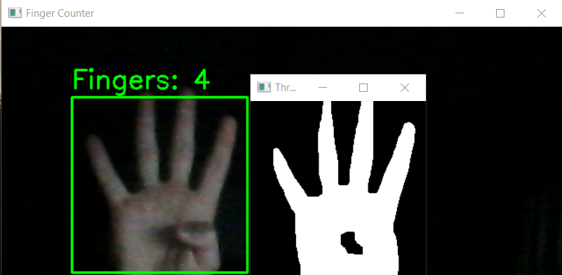
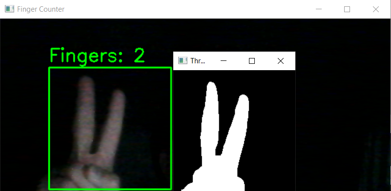

# Real-Time Finger Counting App with Custom CNN and OpenCV

This project is a real-time finger counting application powered by a custom-trained Convolutional Neural Network (CNN). The application uses a webcam to detect and track fingers in a defined region, providing real-time finger count predictions.

## Key Features:

- **Region of Interest (ROI)-based hand tracking**: Tracks the user's hand within a selected area.
- **Custom CNN trained on personal image dataset**: The model is trained on a custom dataset specifically for finger counting.
- **Instant real-time classification with OpenCV**: Provides immediate finger count predictions from the webcam feed.
- **Live video stream with dynamic finger count predictions**: The application overlays the predicted finger count on the live video feed in real time.

## Requirements:

To run this project, ensure that you have the following installed:

- Python 3.x
- Jupyter Notebook
- OpenCV
- TensorFlow
- Keras
- NumPy

You can install the necessary dependencies using:

```bash
pip install opencv-python tensorflow keras numpy jupyter
```

## Usage:

1. Clone the repository:

```bash
git clone https://github.com/CodeForge1231/finger-counter-cnn.git
cd finger-counter-cnn
```

2. Launch the Jupyter Notebook
3. Open the notebook `cnn_finger_classification_roi.ipynb` and run the cells to start the application.
4. The notebook will start the webcam feed and display the real-time finger count prediction.

### Example 1: Prediction for 4 fingers



### Example 2: Prediction for 2 fingers



## Important:

For the model to make accurate predictions, ensure the following conditions:

1. **Clean Background**: For the model to work correctly, it is important to have a background that is as simple and uniform as possible. This means there should be no other objects or movement in the background that could distract the model and create errors in recognition.
2. **Good Lighting**: Lighting is one of the key factors for proper recognition. Poor lighting can result in dark or unclear images, making classification difficult.
3. **Camera Placement**: The camera should be set up in such a way that it clearly captures the user's hands within the selected Region of Interest (ROI). Improper camera placement may lead to inaccurate results.

## Training the Model:

If you want to retrain the custom CNN on your own dataset, follow these steps in the notebook `cnn_finger_classification_training.ipynb`:

1. Run the cell to load your dataset.
2. Preprocess the images: Follow the instructions in the notebook to resize, normalize, and prepare the images for training.
3. Train the CNN model using TensorFlow/Keras: Execute the corresponding cells to build and train the model. The notebook provides step-by-step guidance through the entire process.

The notebook `cnn_finger_classification_training.ipynb` includes all the necessary code for loading, preprocessing, and training the model from scratch.

## Acknowledgements:

- OpenCV for image and video processing.
- TensorFlow and Keras for building and training the custom CNN.
- Special thanks to the open-source community for providing invaluable resources!
